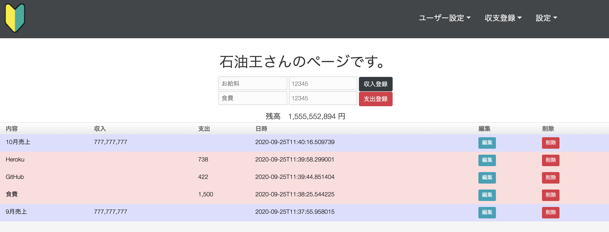

# Practice1
Grails練習用アプリ 色々触ってみながらお小遣い帳のようなアプリを作る。

## 機能
* ユーザー登録
    * ユーザー名とパスワードを登録できる
* ユーザーログイン
    * 登録したユーザーにログインできる
* 収支登録
    * 収支を登録できる
* 収支一覧
    * 収支を確認できる
* 収支編集
    * 登録した収支の内容・金額を変更できる
* 終始削除
    * 登録した収支を論理削除できる
## 課題・問題
* 金額に対して３桁ごとにカンマを表示する方法をJavaScriptで実装したが、実装方法が汚い。
* 認証機能は実装していないので、簡単に他人のデータにアクセス、悪用できる。      
## 謝辞
* [Frame illust](https://frame-illust.com/)
    * 初心者（若葉）マークの画像を使用させていただきました。ありがとうございます。

